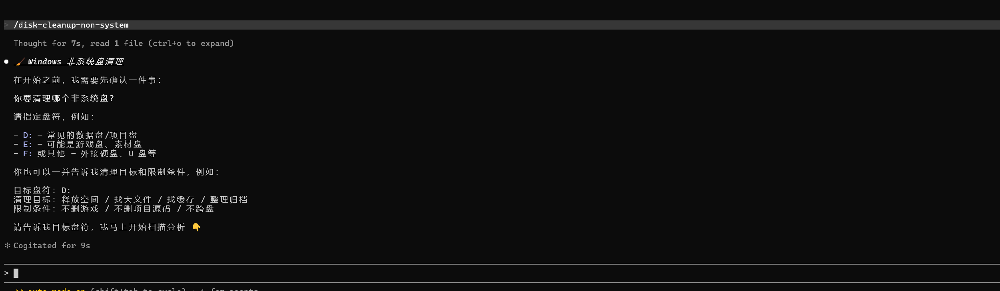
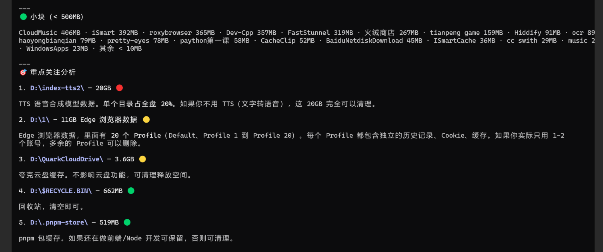
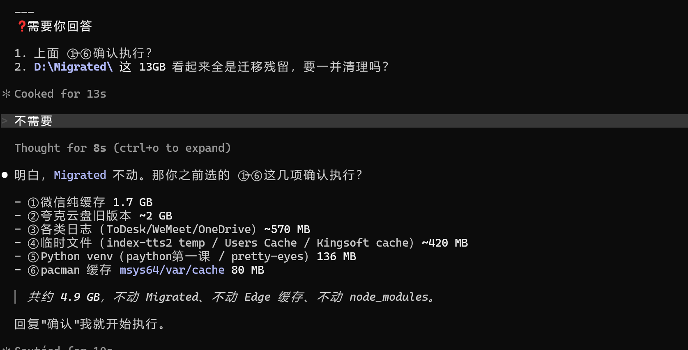

# Windows Disk Cleanup Claude Skills v3 GitHub Edition

本仓库包含两个 Claude Code Skill：

- `disk-cleanup-system`：Windows 系统盘安全清理
- `disk-cleanup-non-system`：指定非系统盘清理与整理

## 目录结构

```text
.claude/
└─ skills/
   ├─ disk-cleanup-system/
   │  ├─ SKILL.md
   │  ├─ references/
   │  └─ scripts/
   │     └─ README.md
   └─ disk-cleanup-non-system/
      ├─ SKILL.md
      ├─ references/
      └─ scripts/
         └─ README.md
README.md
```

上传 GitHub 时可直接上传整个仓库目录。

## 快速使用

1. **复制到全局配置** — 把本仓库里的 `.claude` 文件夹，合并到 `C:\Users\你的用户名\.claude\`
2. **重启 Claude Code**，或在对话框输入 `/reload-plugins`
3. **开始使用**：
   - 清理系统盘：`/disk-cleanup-system 帮我安全清理C盘`
   - 分析其他盘：`/disk-cleanup-non-system 帮我分析D盘`

## v3 重点规则

- 禁止默认全盘递归扫描；
- 默认浅层优先，只看 Top 大项；
- 默认扫描深度 2～3 层；
- 默认输出 Top 20～50 项；
- 大量小文件目录只统计总量，不展开文件级明细；
- 能判断目录类型就早停，不为了完整性强行读完；
- 超时、权限拒绝、Junction 循环风险时跳过并标注；
- 输出为"分类汇总 + 可清理潜力 + 确认清单"；
- 删除、迁移、清空、Docker prune、DISM、关闭休眠等操作必须用户确认。

## 效果展示







## 安全设计说明

本 Skill **不会自动执行任何删除或清理操作**。所有涉及删除、移动、迁移、清空、Docker prune、DISM、关闭休眠等操作，都必须先输出确认清单，得到你明确同意后才会执行。这样的设计是为了确保你对每一步操作都有完全的控制权，避免误删重要文件。
